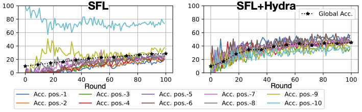
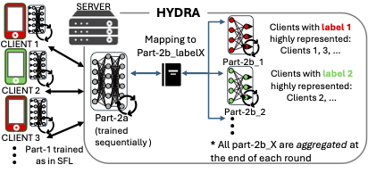

# Hydra: tackling Catastrophic Forgetting (CF) in Split Federated Learning (SFL)

This is a framework for evaluating CF in SFL, SL, and FL. Additionally, it contains the implementation of Hydra, an extension for SplitFedV2 that addresses CF under high heterogeneous data. As shown in the figure below (left), SFL experiences a different type of CF, resulting in a performance disparity between the labels. In detail, we identify that the processing order in SplitFedv2 can cause a new type of CF, named intra-round Catastrophic Forgetting (intraCF). We propose Hydra, a mitigation method to minimize this performance gap and improve overall accuracy, as is also shown in the figure below (right).

  

This repository is based on the paper titled "Data Heterogeneity and Forgotten Labels in Split Federated Learning". 

The paper has been accepted at AAAI 2026.

Link to Paper: /*  wait for AAAI proceedings */

Link to Supplementary Material: /*  TBA arxiv version */

Structure of this Document:
- Set-up Instructions
- Structure of Repos' Files
- Other Assets Used
- Note on Reproducibility and Open Source Policy
- References

### Set-up Instructions

1. Create Python environment
2. Install and set-up PyTorch and torchvision in your environment according to [pytorch-site](https://pytorch.org/get-started/locally/)

3. Additional libraries
> pip install argparse
> pip install logging
> pip install matplotlib
> python -m pip install flwr-datasets==0.2.0
> pip install -U pillow
> pip install bokeh
> conda install anaconda::scikit-learn

4. If needed it add the following line before importing the flower
> np.float_ = np.float64

*Hardware requirements:* 
- In general, no special hardware requirements are required. Note that all experiments run in a one-thread process.
- A use of GPU will definitely accelerate the execution time as deep NN models are used. 
- Note that 'TinyImageNet' requires the largest memory demand. 
- Other datasets can be loaded even with 16GB RAM. 

### Structure of Repos' Files

**All util files:**

- my_utils.py: contains the functions for measuring accuracy, per-label/position accuracy, and the two forgetting scores (Backward trasfer and Performance Gap) in every round.
- get_data.py: constructs the data loaders for every client and group of clients, given the data partitioning method. Essentially, it contains an API function that encapsulates all available operations: 'func: get_data_partition()'. The downloaded dataset will be stored under the '*./data*' folder. Please check below for the other assets we employed for this functionality.
- get_models.py: constructs the model parts for every entity. Inside the folder 'models/', you can find the definition class for all models used. Note that the classes contain a definition for Split Learning, i.e., instead of constructing an object of the whole model, one can ask for only part of the model given the cut-layer definition.  In order to implement these classes, we use PyTorch, but the definition of them has been made from scratch as there is not any library for supporting SL operations. The file  contains an API function that encapsulates all available operations 'func: get_model()'

**Running experiments files:**

We have included the implementation of Hydra (see the Figure below) and all baseline methods that were incorporated into the paper's experiments (systematic analysis and numerical evaluations of Hydra). In detail,

  

- run_hydra.py: implementation of Hydra+SFL 
- test_hydra_heads.py: used for the ablation study of Hydra's number of heads
- run_sfl.py: implementation of SplitFedv2 [1]
- run_fl.py: implementation of FL, which has equal performance with SplitFedv1 [1]
- run_mergesfl.py: implementation of MergeSFL [2]
- run_multihead.py: implementation of Multi-head method [3]
- run_sflv3.py: implementation of SplitFedv3 [4,5]

Note that all experiments, when executed write their results using logging. The logging file for every execution is stored under the *logs_training* folder.

All files contain an *init_parameters* function that describes in detail all input parameters for running the corresponding code. These input parameters align with the experimental set-up and use cases presented in the paper, e.g., batch size, type of data partitioning, model type, dataset type, training hyperparameters, mulitplier parameter phi, etc.

**Test case scripts:**

The following scripts are included:

- run_exp_hydra.sh
- run_exp_sfl.sh
- run_exp_baselines.sh

These files contain examples of how to initiate a new experiment. You can use those scripts by commenting out the command of the experiment you would like to run and commenting out the rest.

### Other Assets Used:

In order to create the datasets, we have used open-source data. In some cases, we utilize the [Flower](https://flower.ai/docs/framework/index.html) library. Also, we found out that for the Dominant Label partition, the implementation of MergeSFL was more handful. The source code of this implementation can be found  [here](https://github.com/ymliao98/MergeSFL/blob/main/datasets.py). Inside our code, we specifically indicate which parts of the code have been used from other assets. Specifically, you can find the corresponding references in comments inside the 'get_data.py' file.

For the implementation of the baseline methods, we built the code from scratch. Specifically for the SplitFedv1/v2/v3 and multihead, we could not find the original code of the paper's authors. Whereas for MergeSFL, we used some part of their code. However, we needed to make plenty of adjustments as the setup differs significantly (i.e., we have a single machine implementation).

## Note on Reproducibility and Open Source Policy

This implementation code, together with the details (e.g., hyperparameter values) provided in the paper and in the code files, will allow the reader to reproduce the presented experiments and claims of the paper. 

### References

[1] Chandra Thapa, Pathum Chamikara Mahawaga Arachchige, Seyit Camtepe, and Lichao Sun. Splitfed: When federated learning meets split learning. In Proceedings of the AAAI Conference on Artificial Intelligence, volume 36, pages 8485–8493, 2022.

[2] Yunming Liao, Yang Xu, Hongli Xu, Lun Wang, Zhiwei Yao, and Chunming Qiao. Mergesfl: Split federated learning with feature merging and batch size regulation. In 2024 IEEE 40th International Conference on Data Engineering (ICDE), pages 2054–2067. IEEE, 2024.

[3] Chunlu Chen, I Kevin, Kai Wang, Peng Li, and Kouichi Sakurai. Flexibility and privacy: A multi-head federated continual learning framework for dynamic edge environments. In 2023 Eleventh International Symposium on Computing and Networking (CANDAR), pages 1–10. IEEE, 2023.

[4] Harshit Madaan, Manish Gawali Viraj Kulkarni, and Aniruddha Pant. Vulnerability due to training order in split learning. In ICT Systems and Sustainability: Proceedings of ICT4SD 2021, Volume 1, pages 103–112. Springer, 2022.

[5] Manish Gawali, CS Arvind, Shriya Suryavanshi, Harshit Madaan, Ashrika Gaikwad, KN Bhanu Prakash, Viraj Kulkarni, and Aniruddha Pant. Comparison of privacy-preserving distributed deep learning methods in healthcare. In Medical Image Understanding and Analysis: 25th Annual Conference, MIUA, pages 457–471. Springer, 2021.
